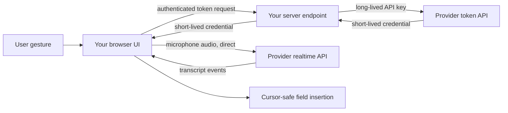

# VoiceInput

Provider-agnostic, cursor-safe voice input for React. VoiceInput captures the
microphone in the browser, streams audio directly to OpenAI, ElevenLabs, or
Deepgram, and inserts transcripts into the field the user is already editing.

The headless hook is the primary API. Optional controls provide a quick start
without creating a second transcription stack.

## Why VoiceInput

- Keep the same field code when switching transcription providers.
- Preserve selections, caret movement, manual edits, and controlled React state.
- Use toggle or hold-to-talk activation with keyboard and pointer support.
- Keep long-lived provider keys on your server.
- Start headless, or use accessible `VoiceButton`, `VoiceInput`, and
  `VoiceTextarea` controls.
- Ship no VoiceInput telemetry, hosted proxy, database, or Tailwind runtime.

## Choose packages

| Package                                                   | Use it for                                                     |
| --------------------------------------------------------- | -------------------------------------------------------------- |
| [`@voiceinput/react`](packages/react/README.md)           | React context, `useVoiceInput`, and optional controls          |
| [`@voiceinput/openai`](packages/openai/README.md)         | OpenAI Realtime transcription; default `gpt-transcribe`        |
| [`@voiceinput/elevenlabs`](packages/elevenlabs/README.md) | ElevenLabs Realtime Scribe; default `scribe_v2_realtime`       |
| [`@voiceinput/deepgram`](packages/deepgram/README.md)     | Deepgram live transcription; default `nova-3`                  |
| [`@voiceinput/core`](packages/core/README.md)             | Framework-neutral sessions, browser audio, and text ownership  |
| [`@voiceinput/provider`](packages/provider/README.md)     | Custom adapter contracts, fake provider, and conformance cases |

A React application normally installs `@voiceinput/react` and one provider
package. `@voiceinput/core` and `@voiceinput/provider` arrive transitively.

## Five-minute quickstart

This OpenAI example uses Next.js App Router. The same React component works with
the other providers; only the adapter and server token handler change.

### 1. Install

```bash
npm install @voiceinput/react @voiceinput/openai
```

### 2. Add an authenticated server route

```ts
// src/app/api/voice-token/route.ts
import { createOpenAITokenHandler } from "@voiceinput/openai/server";
import { getAuthenticatedUser } from "@/lib/auth";

const apiKey = process.env.OPENAI_API_KEY;
if (!apiKey) throw new Error("OPENAI_API_KEY is required.");

export const POST = createOpenAITokenHandler({
  apiKey,
  authorize: async (request) => {
    const user = await getAuthenticatedUser(request);
    return user ? { subject: user.id } : null;
  },
});
```

`authorize` is required. Returning `null` issues no credential. Keep
`OPENAI_API_KEY` in a server-only environment variable—never use a public or
client-prefixed variable.

### 3. Configure the browser adapter

```tsx
// src/app/providers.tsx
"use client";

import { openai } from "@voiceinput/openai";
import { VoiceInputProvider } from "@voiceinput/react";

const voiceProvider = openai({ tokenEndpoint: "/api/voice-token" });

export function AppProviders({ children }: { children: React.ReactNode }) {
  return (
    <VoiceInputProvider provider={voiceProvider}>{children}</VoiceInputProvider>
  );
}
```

Render `AppProviders` around your application from the root layout.

### 4. Enhance a field

```tsx
"use client";

import { useVoiceInput } from "@voiceinput/react";
import { useState } from "react";

export function Composer() {
  const [message, setMessage] = useState("");
  const voice = useVoiceInput({
    value: message,
    onValueChange: setMessage,
    vocabulary: ["VoiceInput", "Acme"],
  });

  return (
    <div>
      <textarea
        ref={voice.targetRef}
        value={message}
        onChange={(event) => setMessage(event.currentTarget.value)}
      />
      <button {...voice.triggerProps}>
        {voice.status === "listening" ? "Stop" : "Speak"}
      </button>
      {voice.error ? <p role="alert">{voice.error.message}</p> : null}
    </div>
  );
}
```

Or use the thin controlled-field wrapper:

```tsx
import { VoiceTextarea } from "@voiceinput/react";

<VoiceTextarea
  value={message}
  onValueChange={setMessage}
  onChange={(event) => setMessage(event.currentTarget.value)}
/>;
```

The controls work without CSS. To opt into the packaged theme, import it once:

```ts
import "@voiceinput/react/styles.css";
```

See the full [Next.js guide](docs/nextjs.md),
[Vite/Hono guide](docs/vite-hono.md), or [Express bridge](docs/express.md).

## Architecture and privacy



Long-lived credentials remain in your server environment. The browser receives
only a provider-scoped short-lived or single-use credential, then sends audio
directly to the selected provider. VoiceInput does not proxy or persist audio or
transcripts, and the open-source packages send no telemetry to VoiceInput-owned
systems. Provider processing and retention follow your provider configuration
and agreement.

## Shared behavior and provider differences

All adapters implement the same versioned session contract and normalize interim
text, final text, speech boundaries, closure, and errors. They do not pretend
provider capabilities are identical.

| Capability           | OpenAI                                         | ElevenLabs           | Deepgram                                                      |
| -------------------- | ---------------------------------------------- | -------------------- | ------------------------------------------------------------- |
| Default model        | `gpt-transcribe`                               | `scribe_v2_realtime` | `nova-3`                                                      |
| PCM16 rate           | 24 kHz                                         | 16 kHz               | 16 kHz                                                        |
| Omitted language     | Automatic                                      | Automatic            | `multi` on known multilingual Nova models; otherwise required |
| Vocabulary mapping   | Prompt, or keywords for live-transcribe models | Key terms            | Nova-3 key terms                                              |
| `endpointing: false` | Manual commit                                  | Manual commit        | Disables endpointing                                          |

Unsupported or invalid normalized options fail before microphone permission is
requested; adapters never silently discard them.

## Browser support

VoiceInput targets the current and previous stable releases of Chrome, Edge,
Firefox, Safari on macOS, and Safari on iOS. It supports React 18 and 19.

Runtime support is capability-based. The browser must provide a secure context,
`getUserMedia`, `AudioContext`, and `AudioWorklet`; microphone access therefore
requires HTTPS except for browser localhost exceptions. Use `isSupported` to
disable custom UI. The packaged controls do this automatically.

See [troubleshooting](docs/troubleshooting.md) for permissions, Safari,
backgrounding, expiring credentials, and network failures.

## Documentation

- [React API](packages/react/README.md)
- [Core API](packages/core/README.md)
- [Provider contract and custom adapters](packages/provider/README.md)
- [OpenAI](packages/openai/README.md)
- [ElevenLabs](packages/elevenlabs/README.md)
- [Deepgram](packages/deepgram/README.md)
- [Write a custom provider](docs/custom-provider.md)
- [Troubleshooting](docs/troubleshooting.md)

## Local development

```bash
corepack enable
pnpm install
cp .env.example .env
pnpm test
pnpm test:browser
pnpm build
pnpm validate:packages
```

The Next.js and Vite/Hono apps are maintainer laboratories. Their signed local
cookie, loopback checks, and in-memory behavior are deliberately
**development-only fixtures**, not production authentication or rate limiting.
See [CONTRIBUTING.md](CONTRIBUTING.md) for the complete workspace commands.

## License

[MIT](LICENSE)
